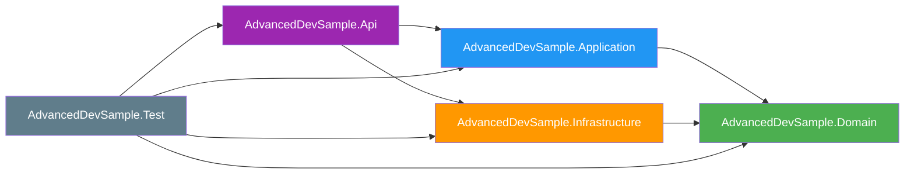
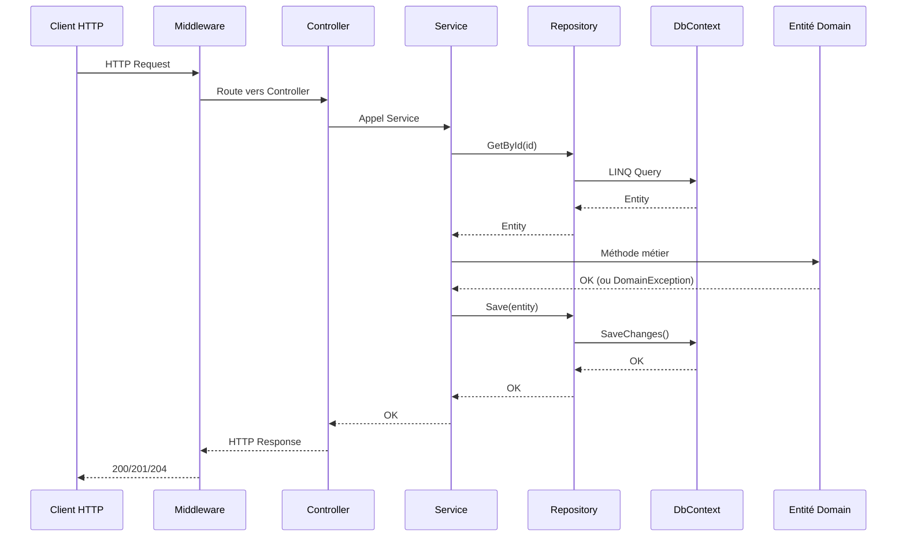
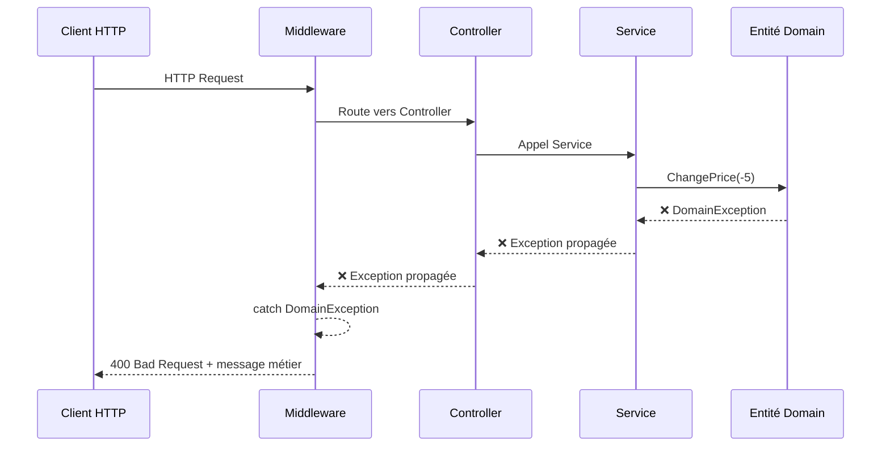

# Diagrammes d'Architecture

## Diagramme d'architecture en couches

```mermaid
graph TB
    subgraph "Couche Présentation (API)"
        PC[ProductsController]
        CC[CustomersController]
        SC[SuppliersController]
        OC[OrdersController]
        MW[ExceptionHandlingMiddleware]
    end

    subgraph "Couche Application"
        PS[ProductService]
        CS[CustomerService]
        SS[SupplierService]
        OS[OrderService]
    end

    subgraph "Couche Domain"
        P[Product]
        C[Customer]
        S[Supplier]
        O[Order]
        OI[OrderItem]
        IP[IProductRepository]
        IC[ICustomerRepository]
        IS[ISupplierRepository]
        IO[IOrderRepository]
        DE[DomainException]
    end

    subgraph "Couche Infrastructure"
        DB[(AppDbContext)]
        EPR[EfProductRepository]
        ECR[EfCustomerRepository]
        ESR[EfSupplierRepository]
        EOR[EfOrderRepository]
        IE[InfrastructureException]
    end

    PC --> PS
    CC --> CS
    SC --> SS
    OC --> OS

    PS --> IP
    CS --> IC
    SS --> IS
    OS --> IO
    OS --> IC
    OS --> IP

    EPR -.->|implémente| IP
    ECR -.->|implémente| IC
    ESR -.->|implémente| IS
    EOR -.->|implémente| IO

    EPR --> DB
    ECR --> DB
    ESR --> DB
    EOR --> DB

    MW -.->|intercepte| DE
    MW -.->|intercepte| IE

    style P fill:#4CAF50,color:#fff
    style C fill:#4CAF50,color:#fff
    style S fill:#4CAF50,color:#fff
    style O fill:#4CAF50,color:#fff
    style OI fill:#4CAF50,color:#fff
```

## Diagramme de dépendances entre projets

```mermaid
graph LR
    API[AdvancedDevSample.Api]
    APP[AdvancedDevSample.Application]
    DOM[AdvancedDevSample.Domain]
    INF[AdvancedDevSample.Infrastructure]
    TST[AdvancedDevSample.Test]

    API --> APP
    API --> INF
    APP --> DOM
    INF --> DOM
    TST --> API
    TST --> APP
    TST --> DOM
    TST --> INF

    style DOM fill:#4CAF50,color:#fff
    style APP fill:#2196F3,color:#fff
    style INF fill:#FF9800,color:#fff
    style API fill:#9C27B0,color:#fff
    style TST fill:#607D8B,color:#fff
```

## Flux d'une requête HTTP

```mermaid
sequenceDiagram
    participant Client as Client HTTP
    participant MW as Middleware
    participant Ctrl as Controller
    participant Svc as Service
    participant Repo as Repository
    participant DB as DbContext
    participant Entity as Entité Domain

    Client->>MW: HTTP Request
    MW->>Ctrl: Route vers Controller
    Ctrl->>Svc: Appel Service
    Svc->>Repo: GetById(id)
    Repo->>DB: LINQ Query
    DB-->>Repo: Entity
    Repo-->>Svc: Entity
    Svc->>Entity: Méthode métier
    Entity-->>Svc: OK (ou DomainException)
    Svc->>Repo: Save(entity)
    Repo->>DB: SaveChanges()
    DB-->>Repo: OK
    Repo-->>Svc: OK
    Svc-->>Ctrl: OK
    Ctrl-->>MW: HTTP Response
    MW-->>Client: 200/201/204
```

## Flux d'erreur (exception)

```mermaid
sequenceDiagram
    participant Client as Client HTTP
    participant MW as Middleware
    participant Ctrl as Controller
    participant Svc as Service
    participant Entity as Entité Domain

    Client->>MW: HTTP Request
    MW->>Ctrl: Route vers Controller
    Ctrl->>Svc: Appel Service
    Svc->>Entity: ChangePrice(-5)
    Entity-->>Svc: ❌ DomainException
    Svc-->>Ctrl: ❌ Exception propagée
    Ctrl-->>MW: ❌ Exception propagée
    MW-->>MW: catch DomainException
    MW-->>Client: 400 Bad Request + message métier
```
