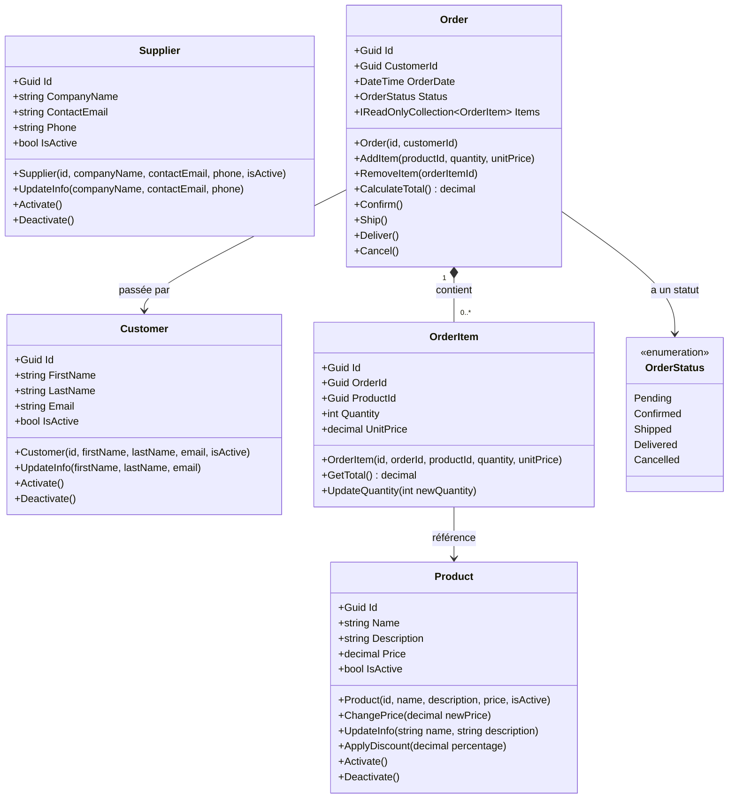
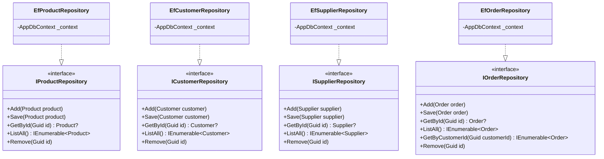
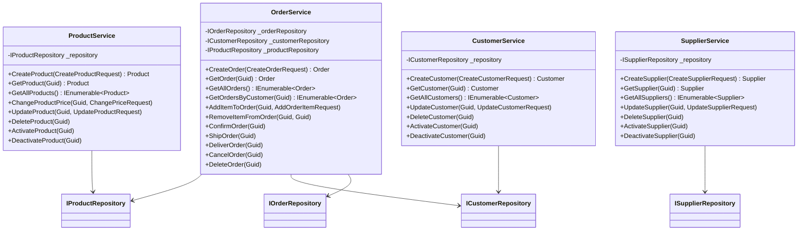
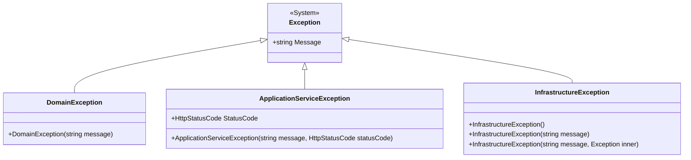

# Diagrammes de Classes

## Entités du Domain

```mermaid
classDiagram
    class Product {
        +Guid Id
        +string Name
        +string Description
        +decimal Price
        +bool IsActive
        +Product(id, name, description, price, isActive)
        +ChangePrice(decimal newPrice)
        +UpdateInfo(string name, string description)
        +ApplyDiscount(decimal percentage)
        +Activate()
        +Deactivate()
    }

    class Customer {
        +Guid Id
        +string FirstName
        +string LastName
        +string Email
        +bool IsActive
        +Customer(id, firstName, lastName, email, isActive)
        +UpdateInfo(firstName, lastName, email)
        +Activate()
        +Deactivate()
    }

    class Supplier {
        +Guid Id
        +string CompanyName
        +string ContactEmail
        +string Phone
        +bool IsActive
        +Supplier(id, companyName, contactEmail, phone, isActive)
        +UpdateInfo(companyName, contactEmail, phone)
        +Activate()
        +Deactivate()
    }

    class Order {
        +Guid Id
        +Guid CustomerId
        +DateTime OrderDate
        +OrderStatus Status
        +IReadOnlyCollection~OrderItem~ Items
        +Order(id, customerId)
        +AddItem(productId, quantity, unitPrice)
        +RemoveItem(orderItemId)
        +CalculateTotal() decimal
        +Confirm()
        +Ship()
        +Deliver()
        +Cancel()
    }

    class OrderItem {
        +Guid Id
        +Guid OrderId
        +Guid ProductId
        +int Quantity
        +decimal UnitPrice
        +OrderItem(id, orderId, productId, quantity, unitPrice)
        +GetTotal() decimal
        +UpdateQuantity(int newQuantity)
    }

    class OrderStatus {
        <<enumeration>>
        Pending
        Confirmed
        Shipped
        Delivered
        Cancelled
    }

    Order "1" *-- "0..*" OrderItem : contient
    Order --> OrderStatus : a un statut
    Order --> Customer : passée par
    OrderItem --> Product : référence
```

## Interfaces Repository

```mermaid
classDiagram
    class IProductRepository {
        <<interface>>
        +Add(Product product)
        +Save(Product product)
        +GetById(Guid id) Product?
        +ListAll() IEnumerable~Product~
        +Remove(Guid id)
    }

    class ICustomerRepository {
        <<interface>>
        +Add(Customer customer)
        +Save(Customer customer)
        +GetById(Guid id) Customer?
        +ListAll() IEnumerable~Customer~
        +Remove(Guid id)
    }

    class ISupplierRepository {
        <<interface>>
        +Add(Supplier supplier)
        +Save(Supplier supplier)
        +GetById(Guid id) Supplier?
        +ListAll() IEnumerable~Supplier~
        +Remove(Guid id)
    }

    class IOrderRepository {
        <<interface>>
        +Add(Order order)
        +Save(Order order)
        +GetById(Guid id) Order?
        +ListAll() IEnumerable~Order~
        +GetByCustomerId(Guid customerId) IEnumerable~Order~
        +Remove(Guid id)
    }

    class EfProductRepository {
        -AppDbContext _context
    }
    class EfCustomerRepository {
        -AppDbContext _context
    }
    class EfSupplierRepository {
        -AppDbContext _context
    }
    class EfOrderRepository {
        -AppDbContext _context
    }

    EfProductRepository ..|> IProductRepository
    EfCustomerRepository ..|> ICustomerRepository
    EfSupplierRepository ..|> ISupplierRepository
    EfOrderRepository ..|> IOrderRepository
```

## Services Application

```mermaid
classDiagram
    class ProductService {
        -IProductRepository _repository
        +CreateProduct(CreateProductRequest) Product
        +GetProduct(Guid) Product
        +GetAllProducts() IEnumerable~Product~
        +ChangeProductPrice(Guid, ChangePriceRequest)
        +UpdateProduct(Guid, UpdateProductRequest)
        +DeleteProduct(Guid)
        +ActivateProduct(Guid)
        +DeactivateProduct(Guid)
    }

    class CustomerService {
        -ICustomerRepository _repository
        +CreateCustomer(CreateCustomerRequest) Customer
        +GetCustomer(Guid) Customer
        +GetAllCustomers() IEnumerable~Customer~
        +UpdateCustomer(Guid, UpdateCustomerRequest)
        +DeleteCustomer(Guid)
        +ActivateCustomer(Guid)
        +DeactivateCustomer(Guid)
    }

    class SupplierService {
        -ISupplierRepository _repository
        +CreateSupplier(CreateSupplierRequest) Supplier
        +GetSupplier(Guid) Supplier
        +GetAllSuppliers() IEnumerable~Supplier~
        +UpdateSupplier(Guid, UpdateSupplierRequest)
        +DeleteSupplier(Guid)
        +ActivateSupplier(Guid)
        +DeactivateSupplier(Guid)
    }

    class OrderService {
        -IOrderRepository _orderRepository
        -ICustomerRepository _customerRepository
        -IProductRepository _productRepository
        +CreateOrder(CreateOrderRequest) Order
        +GetOrder(Guid) Order
        +GetAllOrders() IEnumerable~Order~
        +GetOrdersByCustomer(Guid) IEnumerable~Order~
        +AddItemToOrder(Guid, AddOrderItemRequest)
        +RemoveItemFromOrder(Guid, Guid)
        +ConfirmOrder(Guid)
        +ShipOrder(Guid)
        +DeliverOrder(Guid)
        +CancelOrder(Guid)
        +DeleteOrder(Guid)
    }

    ProductService --> IProductRepository
    CustomerService --> ICustomerRepository
    SupplierService --> ISupplierRepository
    OrderService --> IOrderRepository
    OrderService --> ICustomerRepository
    OrderService --> IProductRepository
```

## Hiérarchie des Exceptions

```mermaid
classDiagram
    class Exception {
        <<System>>
        +string Message
    }
    class DomainException {
        +DomainException(string message)
    }
    class ApplicationServiceException {
        +HttpStatusCode StatusCode
        +ApplicationServiceException(string message, HttpStatusCode statusCode)
    }
    class InfrastructureException {
        +InfrastructureException()
        +InfrastructureException(string message)
        +InfrastructureException(string message, Exception inner)
    }

    Exception <|-- DomainException
    Exception <|-- ApplicationServiceException
    Exception <|-- InfrastructureException
```
