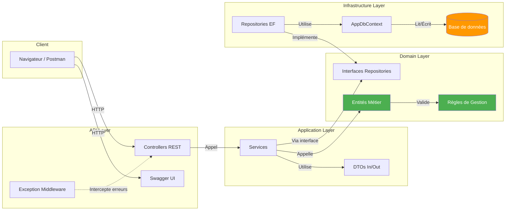
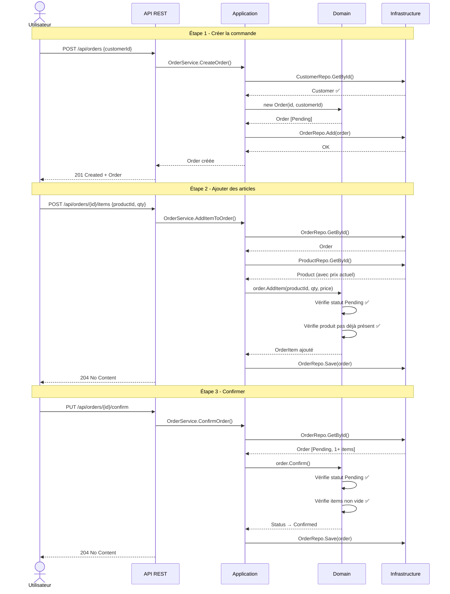
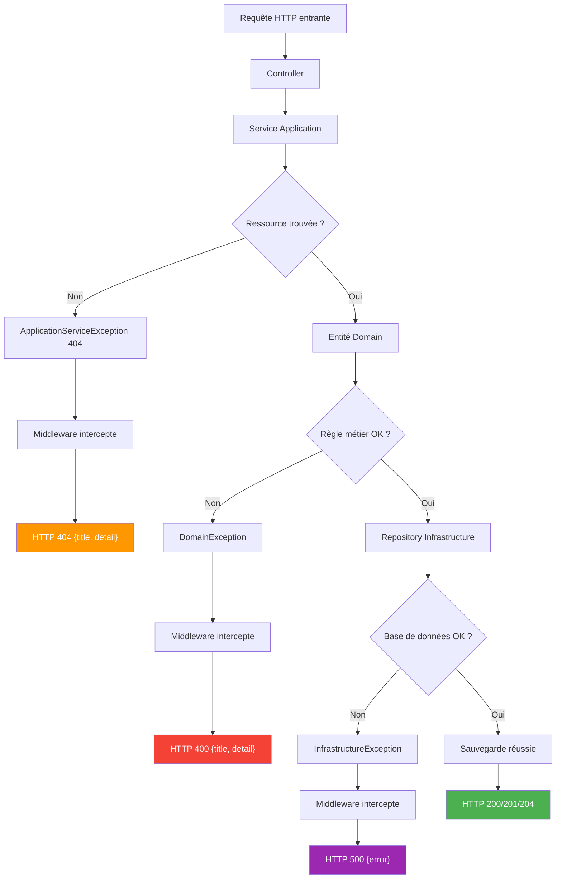
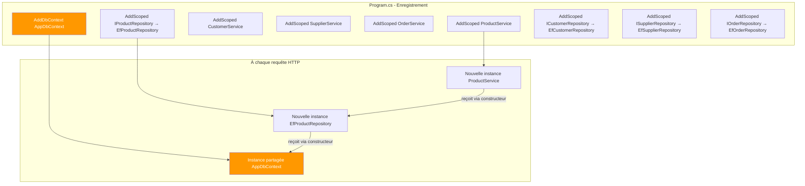

# Diagrammes de Flux

## Flux global de l'application

## Flux de création d'une commande complète

Ce diagramme montre l'enchaînement complet des appels API pour créer, peupler et finaliser une commande.

## Flux de gestion des erreurs

## Flux d'injection de dépendances

Ce diagramme montre comment Program.cs câble les dépendances au démarrage.

