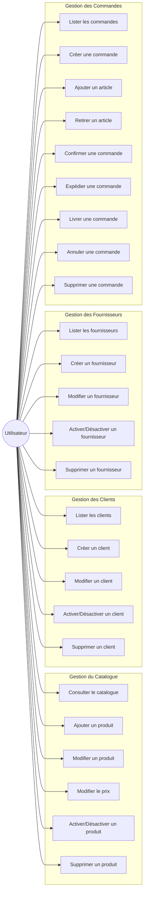
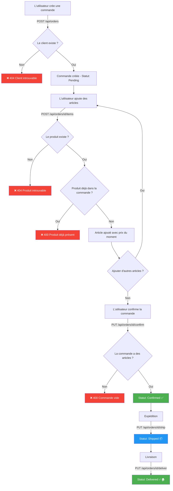
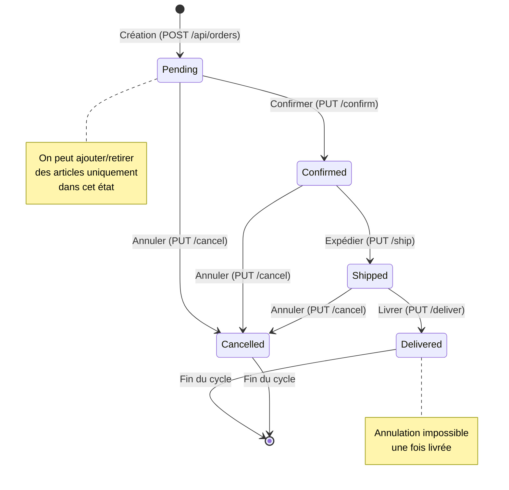
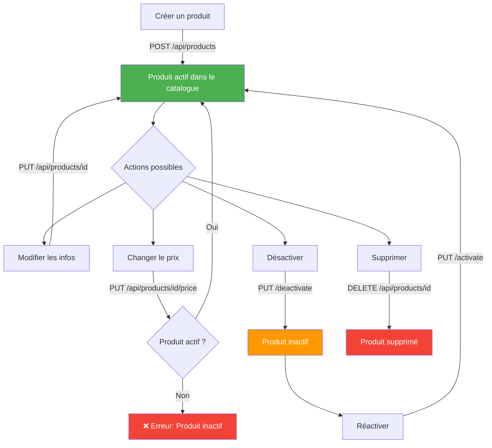
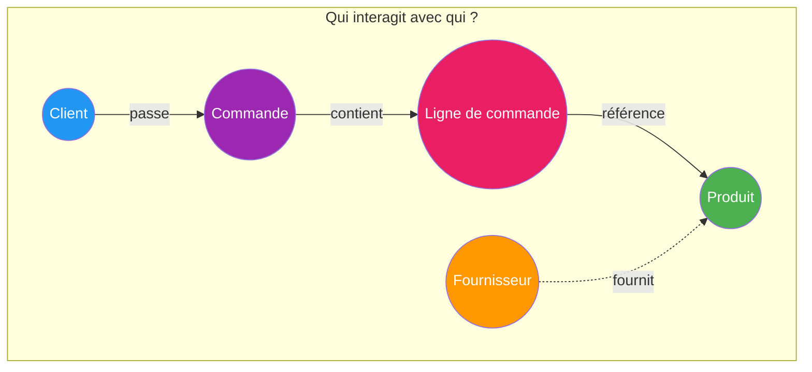

# Diagrammes de Cas d'Utilisation

## Cas d'utilisation globaux

## Flux détaillé : Passer une commande

Ce diagramme montre le parcours complet pour passer une commande, de la création à la livraison.

## Flux détaillé : Cycle de vie d'une commande

## Flux détaillé : Gestion du catalogue produit

## Interactions entre entités

