# Diagrammes de Cas d'Utilisation

## Cas d'utilisation globaux

```mermaid
graph LR
    User((Utilisateur))

    subgraph "Gestion du Catalogue"
        UC1[Consulter le catalogue]
        UC2[Ajouter un produit]
        UC3[Modifier un produit]
        UC4[Modifier le prix]
        UC5[Activer/Désactiver un produit]
        UC6[Supprimer un produit]
    end

    subgraph "Gestion des Clients"
        UC7[Lister les clients]
        UC8[Créer un client]
        UC9[Modifier un client]
        UC10[Activer/Désactiver un client]
        UC11[Supprimer un client]
    end

    subgraph "Gestion des Fournisseurs"
        UC12[Lister les fournisseurs]
        UC13[Créer un fournisseur]
        UC14[Modifier un fournisseur]
        UC15[Activer/Désactiver un fournisseur]
        UC16[Supprimer un fournisseur]
    end

    subgraph "Gestion des Commandes"
        UC17[Lister les commandes]
        UC18[Créer une commande]
        UC19[Ajouter un article]
        UC20[Retirer un article]
        UC21[Confirmer une commande]
        UC22[Expédier une commande]
        UC23[Livrer une commande]
        UC24[Annuler une commande]
        UC25[Supprimer une commande]
    end

    User --> UC1
    User --> UC2
    User --> UC3
    User --> UC4
    User --> UC5
    User --> UC6
    User --> UC7
    User --> UC8
    User --> UC9
    User --> UC10
    User --> UC11
    User --> UC12
    User --> UC13
    User --> UC14
    User --> UC15
    User --> UC16
    User --> UC17
    User --> UC18
    User --> UC19
    User --> UC20
    User --> UC21
    User --> UC22
    User --> UC23
    User --> UC24
    User --> UC25
```

## Flux détaillé : Passer une commande

Ce diagramme montre le parcours complet pour passer une commande, de la création à la livraison.

```mermaid
flowchart TD
    A[L'utilisateur crée une commande] -->|POST /api/orders| B{Le client existe ?}
    B -->|Non| B1[❌ 404 Client introuvable]
    B -->|Oui| C[Commande créée - Statut: Pending]

    C --> D[L'utilisateur ajoute des articles]
    D -->|POST /api/orders/id/items| E{Le produit existe ?}
    E -->|Non| E1[❌ 404 Produit introuvable]
    E -->|Oui| F{Produit déjà dans la commande ?}
    F -->|Oui| F1[❌ 400 Produit déjà présent]
    F -->|Non| G[Article ajouté avec prix du moment]

    G --> H{Ajouter d'autres articles ?}
    H -->|Oui| D
    H -->|Non| I[L'utilisateur confirme la commande]

    I -->|PUT /api/orders/id/confirm| J{La commande a des articles ?}
    J -->|Non| J1[❌ 400 Commande vide]
    J -->|Oui| K[Statut: Confirmed ✅]

    K --> L[Expédition]
    L -->|PUT /api/orders/id/ship| M[Statut: Shipped 📦]

    M --> N[Livraison]
    N -->|PUT /api/orders/id/deliver| O[Statut: Delivered ✅🏠]

    style B1 fill:#f44336,color:#fff
    style E1 fill:#f44336,color:#fff
    style F1 fill:#f44336,color:#fff
    style J1 fill:#f44336,color:#fff
    style K fill:#4CAF50,color:#fff
    style M fill:#2196F3,color:#fff
    style O fill:#4CAF50,color:#fff
```

## Flux détaillé : Cycle de vie d'une commande

```mermaid
stateDiagram-v2
    [*] --> Pending : Création (POST /api/orders)

    Pending --> Confirmed : Confirmer (PUT /confirm)
    Pending --> Cancelled : Annuler (PUT /cancel)

    Confirmed --> Shipped : Expédier (PUT /ship)
    Confirmed --> Cancelled : Annuler (PUT /cancel)

    Shipped --> Delivered : Livrer (PUT /deliver)
    Shipped --> Cancelled : Annuler (PUT /cancel)

    Delivered --> [*] : Fin du cycle
    Cancelled --> [*] : Fin du cycle

    note right of Pending
        On peut ajouter/retirer
        des articles uniquement
        dans cet état
    end note

    note right of Delivered
        Annulation impossible
        une fois livrée
    end note
```

## Flux détaillé : Gestion du catalogue produit

## Interactions entre entités

```mermaid
graph TB
    subgraph "Qui interagit avec qui ?"
        Customer((Client))
        Product((Produit))
        Supplier((Fournisseur))
        Order((Commande))
        OrderItem((Ligne de commande))
    end

    Customer -->|passe| Order
    Order -->|contient| OrderItem
    OrderItem -->|référence| Product
    Supplier -.->|fournit| Product

    style Customer fill:#2196F3,color:#fff
    style Product fill:#4CAF50,color:#fff
    style Supplier fill:#FF9800,color:#fff
    style Order fill:#9C27B0,color:#fff
    style OrderItem fill:#E91E63,color:#fff
```

