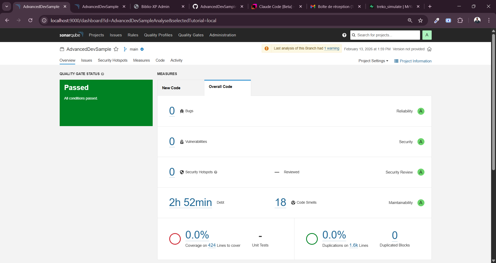

# SonarQube — Analyse de Qualite du Code

## Qu'est-ce que SonarQube ?

SonarQube est une plateforme d'**analyse statique de code** qui inspecte automatiquement le code source pour detecter :

- Les **bugs** potentiels avant qu'ils n'atteignent la production
- Les **vulnerabilites de securite** exploitables par un attaquant
- Les **code smells** : du code qui fonctionne mais qui est difficile a maintenir
- Les **duplications** de code qui augmentent les couts de maintenance
- Le **taux de couverture** des tests unitaires

L'analyse statique est complementaire aux tests : les tests verifient que le code **fait ce qu'il doit faire**, SonarQube verifie que le code **est bien ecrit**.

---

## Les metriques cles

### Bugs (Fiabilite / Reliability)

Un **bug** est une erreur dans le code qui produit un comportement incorrect ou inattendu a l'execution. SonarQube detecte des patterns connus qui menent a des bugs : null pointer dereferences, conditions toujours vraies/fausses, ressources non fermees, etc.

| Note | Signification |
|------|--------------|
| **A** | 0 bug |
| B | Au moins 1 bug mineur |
| C | Au moins 1 bug majeur |
| D | Au moins 1 bug critique |
| E | Au moins 1 bug bloquant |

### Vulnerabilites (Securite / Security)

Une **vulnerabilite** est une faille dans le code qui peut etre exploitee pour compromettre le systeme : injection SQL, XSS, exposition de donnees sensibles, etc.

La notation suit la meme echelle (A a E) que les bugs.

### Security Hotspots

Les **security hotspots** sont des portions de code sensibles qui necessitent une **revue manuelle** pour determiner si elles constituent une vulnerabilite. Exemple : un appel HTTP sans chiffrement est un hotspot — il peut etre intentionnel (environnement local) ou dangereux (production).

### Code Smells (Maintenabilite / Maintainability)

Un **code smell** n'est pas un bug — le code fonctionne correctement. Mais il est mal structure, difficile a comprendre ou a modifier. Exemples : methode trop longue, complexite cyclomatique elevee, nommage ambigu, code mort.

La **dette technique** (Technical Debt) est le temps estime pour corriger tous les code smells. Elle est exprimee en heures/minutes.

| Note | Signification |
|------|--------------|
| **A** | Dette technique <= 5% du temps de developpement |
| B | 6-10% |
| C | 11-20% |
| D | 21-50% |
| E | > 50% |

### Couverture de code (Coverage)

Le **taux de couverture** mesure le pourcentage de lignes de code executees par les tests unitaires. SonarQube ne lance pas les tests lui-meme — il lit un **rapport de couverture** (format OpenCover, Cobertura, etc.) genere lors de l'execution des tests.

> **Note** : Un taux de 0% dans SonarQube signifie generalement qu'aucun rapport de couverture n'a ete fourni lors de l'analyse, pas que les tests n'existent pas.

### Duplications

Le **taux de duplication** mesure le pourcentage de code duplique (blocs de code identiques ou quasi-identiques). Un taux eleve indique des opportunites de refactoring pour extraire du code commun.

---

## Quality Gates

Un **Quality Gate** est un ensemble de **conditions** que le code doit respecter pour etre considere comme acceptable. C'est le verdict final de SonarQube : **Passed** ou **Failed**.

Le Quality Gate par defaut ("Sonar way") applique ces conditions sur le **nouveau code** :

| Condition | Seuil |
|-----------|-------|
| Coverage on New Code | >= 80% |
| Duplicated Lines on New Code | <= 3% |
| Maintainability Rating | A |
| Reliability Rating | A |
| Security Hotspots Reviewed | 100% |
| Security Rating | A |

Si **toutes** les conditions sont respectees, le Quality Gate passe. Si **une seule** echoue, il est en echec.

> **Bonne pratique** : Ne jamais merger une branche dont le Quality Gate est en echec.

---

## Prerequis

| Outil | Version | Verification |
|-------|---------|-------------|
| SonarQube Server | 9.9+ (LTS) | `http://localhost:9000` |
| Java JDK | 17+ | `java -version` |
| .NET SDK | 8.0+ | `dotnet --version` |
| SonarScanner for .NET | Derniere version | `dotnet tool list -g` |

### Installation du scanner

```bash
dotnet tool install --global dotnet-sonarscanner
```

### Demarrage de SonarQube (Docker)

```bash
docker run -d --name sonarqube -p 9000:9000 sonarqube:lts-community
```

Acceder a l'interface : `http://localhost:9000` (identifiants par defaut : `admin` / `admin`).

---

## Lancer une analyse

L'analyse SonarQube se fait en **3 etapes** :

### Etape 1 : Demarrer le scanner

```bash
dotnet sonarscanner begin \
  /key:"AdvancedDevSample" \
  /d:sonar.host.url="http://localhost:9000" \
  /d:sonar.token="<VOTRE_TOKEN>"
```

| Parametre | Description |
|-----------|-------------|
| `/key:` | Cle unique du projet dans SonarQube |
| `/d:sonar.host.url` | URL du serveur SonarQube |
| `/d:sonar.token` | Token d'authentification genere dans SonarQube (`My Account > Security > Generate Tokens`) |

### Etape 2 : Compiler le projet

```bash
dotnet build
```

Le scanner intercepte la compilation pour collecter les informations d'analyse (fichiers sources, assemblies, configuration).

### Etape 3 : Finaliser l'analyse

```bash
dotnet sonarscanner end /d:sonar.token="<VOTRE_TOKEN>"
```

Cette commande envoie les resultats au serveur SonarQube. L'analyse est ensuite visible dans le dashboard.

### Commande complete (copier-coller)

```bash
dotnet sonarscanner begin /key:"AdvancedDevSample" /d:sonar.host.url="http://localhost:9000" /d:sonar.token="<VOTRE_TOKEN>"
dotnet build
dotnet sonarscanner end /d:sonar.token="<VOTRE_TOKEN>"
```

> **Securite** : Ne jamais commiter le token dans le code source. Utiliser des variables d'environnement ou des secrets CI/CD.

### Avec rapport de couverture

Pour que SonarQube affiche le taux de couverture, ajouter le parametre `sonar.cs.opencover.reportsPaths` et executer les tests avec collecte de couverture :

```bash
dotnet sonarscanner begin \
  /key:"AdvancedDevSample" \
  /d:sonar.host.url="http://localhost:9000" \
  /d:sonar.token="<VOTRE_TOKEN>" \
  /d:sonar.cs.opencover.reportsPaths="**/coverage.opencover.xml"

dotnet build

dotnet test --no-build --collect:"XPlat Code Coverage" --settings coverlet.runsettings

dotnet sonarscanner end /d:sonar.token="<VOTRE_TOKEN>"
```

---

## Resultats du projet AdvancedDevSample

Derniere analyse : **13 fevrier 2026** — Branche `main`



### Synthese

| Metrique | Resultat | Note |
|----------|----------|------|
| **Quality Gate** | **Passed** | Toutes les conditions respectees |
| Bugs | 0 | Reliability **A** |
| Vulnerabilites | 0 | Security **A** |
| Security Hotspots | 0 | Security Review **A** |
| Code Smells | 18 | Maintainability **A** |
| Dette technique | 2h 52min | — |
| Couverture | 0.0% (424 lignes) | Rapport non fourni lors de cette analyse |
| Duplications | 0.0% (1.6k lignes) | 0 blocs dupliques |

### Interpretation

- **0 bug, 0 vulnerabilite, 0 hotspot** : le code est fiable et securise selon l'analyse statique
- **18 code smells / 2h52 de dette** : maintenabilite note A — la dette reste tres faible par rapport a la taille du projet
- **0% de couverture** : le projet dispose de **198 tests** (unitaires, composants, integration) mais le rapport de couverture n'a pas ete transmis a SonarQube lors de cette analyse. Pour corriger, utiliser la commande avec `sonar.cs.opencover.reportsPaths` decrite ci-dessus
- **0% de duplication** : aucun bloc de code duplique detecte

---

## Integration CI/CD

Le projet dispose d'un workflow GitHub Actions (`.github/workflows/ci-cd.yml`) qui execute automatiquement l'analyse SonarCloud sur chaque push sur `main` :

```yaml
sonar-analyze:
    runs-on: ubuntu-latest
    steps:
        - uses: actions/checkout@v4
          with:
              fetch-depth: 0
        - name: Setup .NET
          uses: actions/setup-dotnet@v4
          with:
              dotnet-version: 8.0.x
        - name: Install SonarQube Cloud scanner
          run: dotnet tool install --global dotnet-sonarscanner
        - name: Build and analyze
          env:
              GITHUB_TOKEN: ${{ secrets.GITHUB_TOKEN }}
              SONAR_TOKEN: ${{ secrets.SONAR_TOKEN }}
          run: |
              dotnet-sonarscanner begin /k:"Syhard87_AdvancedDevSample" /o:"syhard87" /d:sonar.token="${{ secrets.SONAR_TOKEN }}" /d:sonar.host.url="https://sonarcloud.io" /d:sonar.cs.opencover.reportsPaths="**/coverage.opencover.xml"
              dotnet build
              dotnet test --no-build --verbosity normal --collect:"XPlat Code Coverage" --settings coverlet.runsettings
              dotnet-sonarscanner end /d:sonar.token="${{ secrets.SONAR_TOKEN }}"
```

> **Note** : En CI/CD, le workflow utilise **SonarCloud** (`sonarcloud.io`) au lieu du SonarQube local. Le token `SONAR_TOKEN` est stocke dans les **GitHub Secrets** du repository.

---

## Ressources

- [Documentation SonarQube](https://docs.sonarsource.com/sonarqube/)
- [SonarScanner for .NET](https://docs.sonarsource.com/sonarqube/latest/analyzing-source-code/scanners/dotnet/introduction/)
- [Coverlet — Code Coverage for .NET](https://github.com/coverlet-coverage/coverlet)
